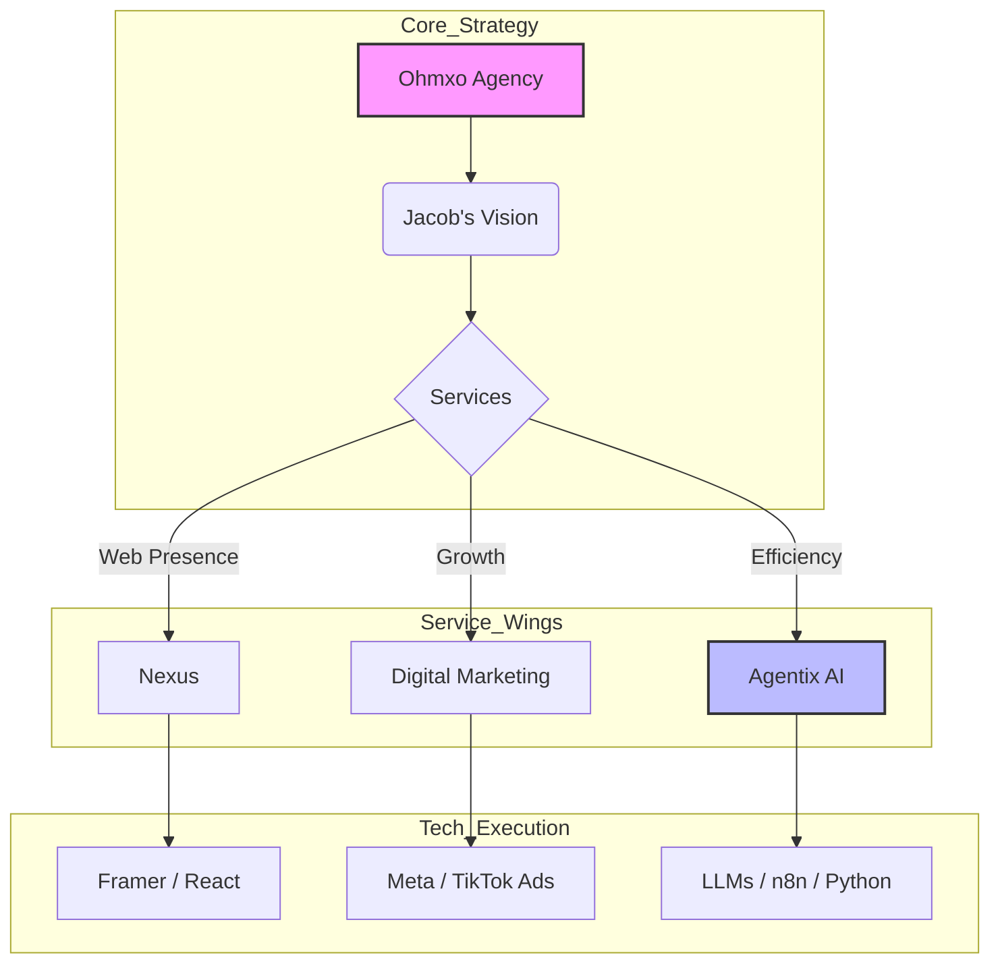

# Ohmxo Agency: Internal Knowledge Base

> **Latest Update:** December 21, 2025
> **Maintainer:** Jacob
> **Status:** Active

---

## 📑 Table of Contents
1. [Overview](#-overview)
2. [Company Profile](#-company-profile)
3. [Target Audience](#-target-audience)
4. [Services & Solutions](#-services--solutions)
5. [The Ohmxo Ecosystem (Visualized)](#-the-ohmxo-ecosystem-visualized)
6. [Tech Stack & Expertise](#-tech-stack--expertise)
7. [Success Stories](#-success-stories)

---

## 📖 Overview
**Ohmxo Agency** is a cutting-edge digital architecture firm bridging the gap between creative industries and advanced technology. We specialize in building comprehensive digital ecosystems for artists, brands, and creative enterprises.

---

## 🏛️ Company Profile

### 🚀 Our Story
**From A&R to Digital Architect**
Founded in 2022 by **Jacob**, Ohmxo was born from the music industry. Recognizing a massive gap in how creatives utilized technology, Jacob pivoted from A&R to master advanced web development and AI architecture. This unique "Music x Tech" DNA allows Ohmxo to serve artists with the technical prowess of a Silicon Valley startup.

### 💎 Mission & Philosophy
> **"To meticulously architect comprehensive digital ecosystems tailored for artists, brands, and creative enterprises."**

We don't just build websites; we integrate **Nexus** (Web Systems) with **Agentix** (AI Automation) to unlock unparalleled efficiency.

---

## 🎯 Target Audience

| Client Type | Profile & Needs |
| :--- | :--- |
| **🎵 Musicians** | Solo artists & bands needing digital distribution, fanbase growth, and immersive sites. |
| **🏢 Music Businesses** | Labels & studios seeking operational efficiency and modern web platforms. |
| **👔 Management** | Agencies wanting to streamline artist visibility and internal workflows. |
| **🎨 Creative Brands** | Designers & entrepreneurs requiring bespoke digital storefronts and marketing. |

---

## 🛠️ Services & Solutions

### 1. **Agentix** (AI Automation) `Flagship`
*Transformative intelligent systems powered by LLMs.*
*   🤖 **Workflow Automation:** Eliminate repetitive tasks.
*   💬 **Smart Chatbots:** Intelligent customer service agents.
*   📊 **Data Analysis:** Automated insights and content generation.

### 2. **Nexus** (Web Design)
*Beyond websites—dynamic digital experiences.*
*   **Platforms:** Framer (Primary), Next.js.
*   **Portfolio:** [Day One Music](https://www.dayonemusic.com) | [Taylor Made Studios](https://www.taylormadestudios.com)

### 3. **Digital Marketing**
*Data-driven performance advertising.*
*   **Meta Ads:** Precision targeting (FB/IG).
*   **TikTok Ads:** Viral content strategies.
*   **Google Ads:** Search & Display dominance.

---

## 🧬 The Ohmxo Ecosystem (Visualized)

---

## 💻 Tech Stack & Expertise

<strong>Click to expand full Technical Architecture</strong>

### 🛠️ Development Tools
*   **IDE:** Cursor (w/ MCP Servers)
*   **Design:** Figma, Photoshop, After Effects
*   **Database:** Airtable

### ⚙️ Engineering Core
| Layer | Technologies |
| :--- | :--- |
| **Languages** | `Python` `TypeScript` `Go` |
| **Frontend** | `React` `Next.js` `Framer` |
| **Backend** | `Node.js` `FastAPI` |
| **Automation** | `n8n` `Make.com` |

---

## 📈 Success Stories

### 🌟 Spotlight: Indie Artist Growth
> **The Challenge:** An independent artist struggling with low streaming numbers and limited reach.

**The Ohmxo Solution:**
1.  Analyzed core demographics.
2.  Executed strategic ad placements.
3.  Optimized content for engagement.

**The Result:**
*   🚀 **200% Increase** in monthly listeners.
*   Expanded fanbase foundation.

---

## 🔗 Quick Links
*   🌍 **Website:** [Ohmxo.co](https://ohmxo.co)
*   📧 **Contact:** Jacob (Founder)
